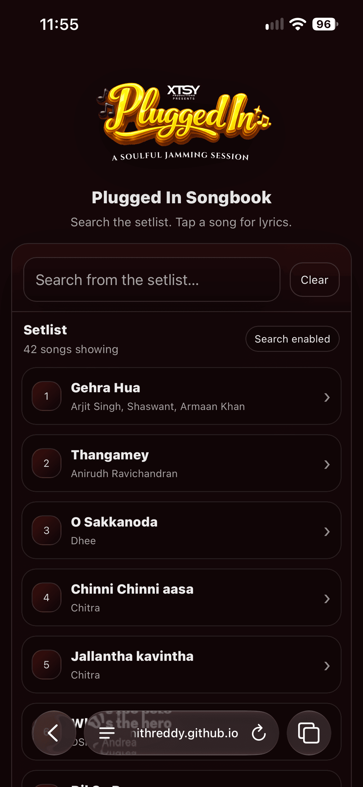
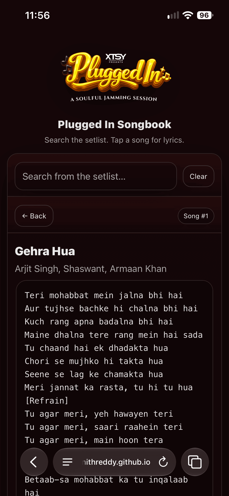

# Plugged In: a live-gig songbook you pull up on your phone

Plugged In is a single-page songbook built for a live music event. It holds the
band's full setlist for the night, 42 songs across Telugu, Tamil and Hindi, and
lets anyone in the crowd search it instantly and tap a song to read the lyrics
and sing along. It is one HTML file: no framework, no backend, no build step.
Open it on a phone and it behaves like a small app.

> I built this in my own time for a live jamming session we ran earlier this year
> under XTSY. We coordinated with the band who were performing, got their setlist
> for the night, and I turned it into a web page the audience could reach through
> a single QR code at the venue. Scan it, and the whole setlist is in your hand,
> so you can follow along and sing with the band instead of guessing the words.
> It started from that very ordinary problem, and I wanted something clean that
> just worked on a phone in a dark room. I had not written a proper client-side
> search before, so I taught myself how to do it from scratch: how to make search
> ignore accents, how to highlight matches, how to move between a list and a
> detail view without a framework. The point was to build one genuinely useful
> thing end to end and understand every line of it.

## What it does

- **Instant search over the setlist.** Type any part of a title or artist and the
  list filters as you go. Clear resets it.
- **Accent-insensitive matching.** Searching `malare` finds *Malare* even though
  the data has accented and stylised characters. Every string is normalised
  (Unicode NFD, combining marks stripped) before comparison, so the crowd does not
  have to type diacritics to find a song.
- **Match highlighting.** The part of the title or artist that matched your query
  is highlighted, so it is obvious why a result showed up.
- **List, song, back.** Tap a song to open a full-screen lyrics view; the back
  button returns you to exactly where you were scrolled to in the list.
- **Reads well in a venue.** Dark theme, large tap targets, a back-to-top button,
  and a clear no-results state. Lyrics render in a monospaced block so long
  multi-language verses keep their line breaks.

## Screenshots

<!--
To add these: create a folder named "screenshots" in this repo, drop your images
in with these names, and they will show up below. Or on GitHub, edit this file in
the browser and drag an image straight into the editor, then replace the path.
-->

| Setlist and search | Song lyrics |
|---|---|
|  |  |

## How it is built

| Piece | Detail |
|---|---|
| Structure | One `index.html` with markup, styles and logic in a single file |
| Data | Songs are a plain JavaScript array of `{ id, title, artist, lyrics }` |
| Search | `String.normalize("NFD")` plus diacritic stripping, then case-insensitive substring match |
| Highlight | Escapes HTML first, then wraps the matched span in `<mark>` so lyrics cannot inject markup |
| UI | Vanilla DOM, a list view and a detail view toggled in place, scroll position remembered |
| Mobile | Installable-feeling web app: theme colour, `apple-mobile-web-app` meta tags, `safe-area-inset` padding for notched phones |
| Dependencies | None. No libraries, no fonts fetched, no network calls |

Adding or editing a song is just editing the `SONGS` array. Nothing else changes.

## Run it

It is a single static file, so there is nothing to install:

```bash
open index.html          # macOS
# or serve the folder if you prefer a local URL
python -m http.server 8000   # then visit http://localhost:8000
```

To deploy, drop the folder on any static host (GitHub Pages, Vercel, Netlify,
Cloudflare Pages) and point a QR code at the URL.

## Files

```
PluggedIn/
├── index.html      # the entire app: setlist data, search, lyrics view, styling
├── screenshots/    # images shown in this README
└── main/           # logo and image assets
```
